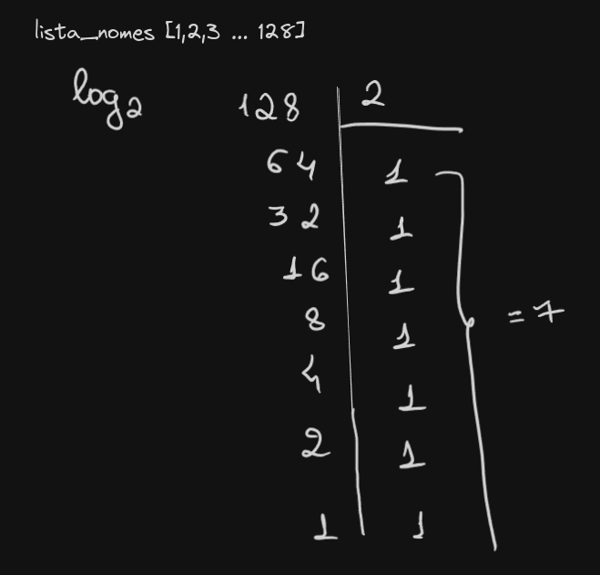

# 1.1 Suponha que voce tenha uma lista com 128 nomes e esteja fazendo uma pesquisa binaria. Qual seria o numero maximo de etapas que voce levaria para encontrar o nome desejado?

```
lista_nomes [1,2,3...128]
resposta 7
```



# 1.2 Suponha que voce duplique o tamanho da lista. Qual seria o numero maximo de etapas agora?

```
resposta 8
explicacao: adicionaria somente +1 pois: 128x2 = 256,
256/2 = 128
128/2 = 64
64/2 = 32
32/2 = 16
16/2 = 8
8/2 = 4
4/2 = 2
2/2 = 1//

```
